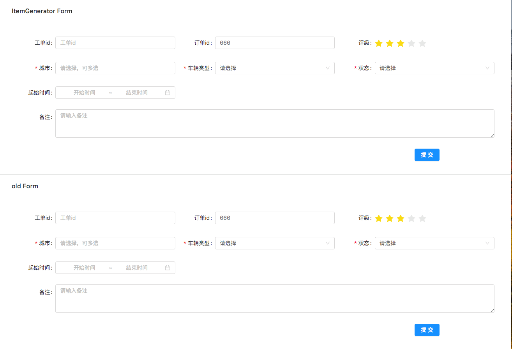

# react-generator-form

> 通过配置生成表单,简化基于antd的表单应用

## Development

```bash
git clone git@github.com:LittleBearBond/react-generator-form.git
cd react-generator-form
npm i
npm start
```

## [使用react-generator-from开发一个表单 vs 使用antd原生方式开发相同的表单](./examples/ItemGenerator/home.js)

> 我用两种方式实现了一个一模一样的表单，方便对比



### [使用antd原生方式开发表单](./examples/ItemGenerator/OldForm.js)

```js
import React, { Component } from 'react'

import { Button, Form, Card, Row, Col, Input, InputNumber, Select, Rate, DatePicker } from 'antd';

const { Item: FormItem } = Form
const { Option } = Select
const { RangePicker } = DatePicker;
const { TextArea } = Input
const colProps = {
    xl: 8, lg: 12, sm: 24
}
export const formItemStyle = {
    labelCol: {
        md: { span: 6 },
        lg: { span: 8 },
        xl: { span: 6 }
    },
    wrapperCol: {
        md: { span: 18 },
        lg: { span: 16 },
        xl: { span: 18 }

    }
};

const requiredRules = {
    rules: [
        { required: true, message: '请选择' }
    ]
}
class OldForm extends Component {
    submitForm = () => {
        this.props.form.validateFields(console.log)
    }
    render() {
        const { form } = this.props;
        const { getFieldDecorator } = form;
        return (
            <Card title="old Form">
                <Form style={{ background: '#fff', padding: '10px' }}>
                    <Row>
                        <Col {...colProps}>
                            <FormItem {...formItemStyle} label="工单id">
                                {
                                    getFieldDecorator('mjid-old', {
                                        initialValue: '',
                                        rules: [{
                                            type: 'number',
                                            message: '请输入数字'
                                        }],
                                    })(<InputNumber placeholder="工单id" style={{ width: '100%' }} />)
                                }
                            </FormItem>
                        </Col>
                        <Col {...colProps}>
                            <FormItem {...formItemStyle} label="订单id">
                                {
                                    getFieldDecorator('orderId-old', {
                                        initialValue: '666',
                                    })(<Input placeholder="订单id" />)
                                }
                            </FormItem>
                        </Col>
                        <Col {...colProps}>
                            <FormItem {...formItemStyle} label="评级">
                                {
                                    getFieldDecorator('rate-old', {
                                        initialValue: 3,
                                    })(<Rate />)
                                }
                            </FormItem>
                        </Col>
                        <Col {...colProps}>
                            <FormItem {...formItemStyle} label="城市">
                                {
                                    getFieldDecorator('cityId-old', {
                                        ...requiredRules
                                    })(<Select mode="multiple" placeholder='请选择，可多选'>
                                        <Option value='22'>上海</Option>
                                        <Option value='33'>广州</Option>
                                        <Option value='11'>北京</Option>
                                    </Select>)
                                }
                            </FormItem>
                        </Col>
                        <Col {...colProps}>
                            <FormItem {...formItemStyle} label="车辆类型">
                                {
                                    getFieldDecorator('carType-old', {
                                        initialValue: '',
                                        ...requiredRules
                                    })(<Select>
                                        <Option value=''>请选择</Option>
                                        <Option value='22'>货车</Option>
                                        <Option value='33'>小汽车</Option>
                                        <Option value='11'>大卡车</Option>
                                    </Select>)
                                }
                            </FormItem>
                        </Col>
                        <Col {...colProps}>
                            <FormItem {...formItemStyle} label="状态">
                                {
                                    getFieldDecorator('status-old', {
                                        initialValue: '',
                                        ...requiredRules
                                    })(<Select>
                                        <Option value=''>请选择</Option>
                                        <Option value='0'>未处理</Option>
                                        <Option value='1'>处理中</Option>
                                        <Option value='2'>已处理</Option>
                                    </Select>)
                                }
                            </FormItem>
                        </Col>
                        <Col {...colProps}>
                            <FormItem {...formItemStyle} label="起始时间">
                                {
                                    getFieldDecorator('startAndEndTime-old', {
                                        initialValue: [],
                                    })(<RangePicker
                                        placeholder={['开始时间', '结束时间']}
                                        showTime={{ defaultValue: '' }}
                                        style={{
                                            width: 'auto'
                                        }}
                                        format="YYYY-MM-DD HH:mm:ss"
                                    />)
                                }
                            </FormItem>
                        </Col>
                        <Col xs={24} lg={24} sm={24}>
                            <FormItem
                                labelCol={
                                    {
                                        md: { span: 6 },
                                        lg: { span: 4 },
                                        xl: { span: 2 },
                                    }
                                }
                                wrapperCol={{
                                    md: { span: 16 },
                                    lg: { span: 20 },
                                    xl: { span: 22 },
                                }}
                                label="备注">
                                {
                                    getFieldDecorator('comment-old', {
                                        initialValue: [],
                                    })(<TextArea
                                        placeholder='请输入备注'
                                        rows={3}
                                    />)
                                }
                            </FormItem>
                        </Col>
                        <Col offset={20} span={24}><Button onClick={this.submitForm} type="primary">提交</Button></Col>
                    </Row>
                </Form>
            </Card>
        )
    }
}
export default Form.create()(OldForm)
```

### 使用react-generator-from开发表单

#### [config 表单配置](./examples/ItemGenerator/config.js)

```js
import React from 'react'
import { colOneLineProps, LEFT_RIGHT } from '../../src/layout'
import { Rate } from 'antd';

const requiredRules = {
    rules: [
        { required: true, message: '请选择' }
    ]
}

export const items = [
    {
        item: {
            id: 'mjId',
            label: '工单id',
            options: {
                initialValue: '',
                rules: [{
                    type: 'number',
                    message: '请输入数字'
                }]
            },
            type: 'number'
        }
    },
    {
        item: {
            id: 'orderId',
            label: '订单id',
            options: {
                // 设置初始值
                initialValue: '666', // 只针对input
            }
        }
    },
    {
        item: {
            id: 'rate',
            label: '评级',
            options: {
                initialValue: 3,
            },
            // 自定义模板
            template: <Rate />
        }
    },
    {
        item: {
            id: 'cityId',
            type: 'select',
            label: '城市',
            options: {
                initialValue: [],
                ...requiredRules
            },
            // 下拉框默认渲染id value [{id:'',value:''}]
            // 如果不是id value 需要手动指定相应的key
            // 一般这种下拉框数据由后端从统一配置接口吐出
            data: [
                {
                    id: 22,
                    name: '上海'
                },
                {
                    id: 33,
                    name: '广州'
                },
                {
                    id: 11,
                    name: '北京'
                },
            ],
            params: {
                value: 'name',
                isShowPleaseSel: true
            },
            props: {
                mode: 'multiple',
                placeholder: '请选择，可多选'
            }
        }
    },
    {
        item: {
            id: 'carType',
            type: 'select',
            label: '车辆类型',
            options: {
                initialValue: '',
                ...requiredRules
            },
            // 下拉框默认渲染id value [{id:'',value:''}]
            // 如果不是id value 需要手动指定相应的key
            data: [
                {
                    uid: 22,
                    name: '货车'
                },
                {
                    uid: 33,
                    name: '小汽车'
                },
                {
                    uid: 11,
                    name: '大卡车'
                },
            ],
            params: {
                value: 'name',
                id: 'uid',
                isShowPleaseSel: true
            }
        }
    },
    {
        item: {
            id: 'status',
            type: 'select',
            label: '状态',
            options: {
                initialValue: '',
                ...requiredRules
            },
            // 直接使用数组，数组的index 会作为value提交到后端
            data: ['未处理', '处理中', '已处理'],
        }
    },
    {
        item: {
            id: 'startAndEndTime',
            label: '起始时间',
            options: {
                initialValue: '',
            },
            type: 'rangepicker',
            props: {
                showTime: {
                    defaultValue: ''
                },
                placeholder: ['开始时间', '结束时间'],
                style: {
                    width: 'auto'
                },
                format: 'YYYY-MM-DD HH:mm:ss',
                // disabledDate: (current) => current && current.valueOf() >= Date.now(),
            }
        }
    },
    {
        item: {
            id: 'comment',
            label: '备注',
            options: {
                initialValue: '',
            },
            type: 'textarea',
            props: {
                rows: 3,
                placeholder: '请输入备注',
            }
        },
        // 单独设置布局效果
        // 独占一行
        colProps: colOneLineProps,
        // 左右布局按相关比例
        formItemProps: LEFT_RIGHT
    },
];
```

#### [GeneratorForm，传入配置，调用ItemGenerator，直接创建一个表单](./examples/ItemGenerator/GeneratorForm.js)

```js
import React, { Component } from 'react'
import ItemGenerator from '../../index';
import { Form, Card, Row, Col, Button } from 'antd';
import { items } from './config';

class GeneratorForm extends Component {
    submitForm = () => {
        this.props.form.validateFields(console.log)
    }
    render() {
        const { form } = this.props;

        return (
            <Card title="ItemGenerator Form">
                <Form style={{ background: '#fff', padding: '10px' }}>
                    <Row>
                        <ItemGenerator form={form}
                            options={{
                                items
                            }} />
                        <Col offset={20} span={24}><Button onClick={this.submitForm} type="primary">提交</Button></Col>
                    </Row>
                </Form>
            </Card>
        )
    }
}

export default Form.create()(GeneratorForm)

```
